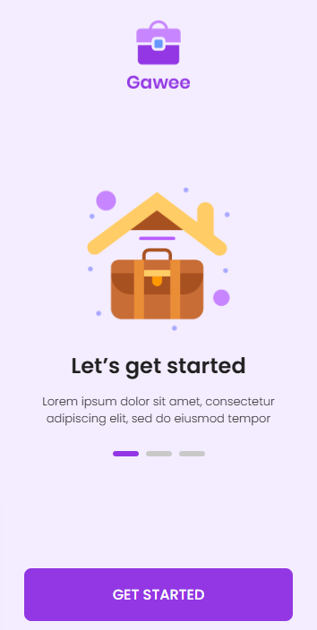
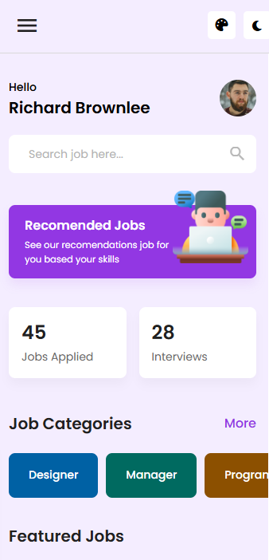

<div align="center">

  <h1>🚀 Gawee</h1>
  <p><strong>Modern Job Finder Application built with Flutter & Supabase</strong></p>

  <p>
    <a href="https://flutter.dev/">
      
    </a>
    <a href="https://dart.dev/">
      
    </a>
    <a href="https://supabase.com/">
      
    </a>
  </p>

  <p>
    
    
    
  </p>

</div>

<br />

> **Gawee** is a modern mobile application built with Flutter that connects job seekers with recruiters. It features a seamless onboarding experience, real-time job updates, dynamic job posting, and social authentication, powered by a Supabase backend.

---

## 💻 How to Run (VS Code)

Follow these steps to run the application on your local machine using Visual Studio Code.

### 1. Prerequisites
Ensure you have the following installed:
* [VS Code](https://code.visualstudio.com/)
* [Flutter SDK](https://docs.flutter.dev/get-started/install) (ver 3.0 or later)
* [Git](https://git-scm.com/)
* **VS Code Extensions**:
    * Flutter (by Dart Code)
    * Dart (by Dart Code)
 
### 2. Open in VS Code
Open the project folder in Visual Studio Code:

Bash

code .

## 📱 Screenshots

<div align="center">
  <table>
    <tr>
      <td align="center"><b>Onboarding</b></td>
      <td align="center"><b>Dashboard</b></td>
      <td align="center"><b>Job Details</b></td>
      <td align="center"><b>Post Job</b></td>
    </tr>
    <tr>
      <td></td>
      <td></td>
      <td></td>
      <td></td>
    </tr>
  </table>
</div>

---

## ✨ Key Features

### 🔐 Authentication
- [x] Secure Email/Password Login & Register.
- [x] **Google Sign-In Integration** with auto-sync to user profiles.
- [x] Role-based access (Job Seeker / Recruiter).

### 👋 User Experience
- [x] Interactive Onboarding Carousel with `smooth_page_indicator`.
- [x] Role selection screen (Seeker vs Recruiter).
- [x] Dark Mode & Light Mode support (`ThemeProvider`).

### 🏠 Dashboard & Job Management
- [x] **Real-time Stats:** Track "Jobs Applied" and "Interviews" updated via Supabase Realtime.
- [x] **Dynamic Categories:** Automatically generated based on available jobs.
- [x] **Post a Job:** Recruiters can post jobs with dynamic Requirements lists.
- [x] **Bookmark:** Save favorite jobs for later.

### 💬 Chat & Apply
- [x] Direct Chat feature between applicants and companies.
- [x] "Apply Job" mechanism using bottom sheet submission.

---

## 🛠 Tech Stack

| Category | Technology |
| :--- | :--- |
| **Framework** | Flutter (Dart) |
| **Backend** | Supabase (PostgreSQL) |
| **Auth** | Supabase Auth (Email & Google) |
| **State Mgt** | Provider |
| **Fonts** | Google Fonts (Poppins) |

---

## 🗄️ Database Schema

The application relies on the following table structures in Supabase:

| Table Name | Description | Key Columns |
| :--- | :--- | :--- |
| **`profiles`** | Syncs with Auth Users | `id`, `full_name`, `email`, `role`, `avatar_url` |
| **`jobs`** | Job Postings | `id`, `title`, `company_name`, `salary_range`, `requirements`, `category` |
| **`applications`** | Tracks applicants | `id`, `job_id`, `applicant_id`, `status` |

---

## 🚀 Getting Started

### Prerequisites
* Flutter SDK installed (3.0+).
* A Supabase project created.

### Installation

1.  **Clone the repository**
    ```bash
    git clone [https://github.com/username/gawee.git](https://github.com/username/gawee.git)
    cd gawee
    ```

2.  **Install Dependencies**
    ```bash
    flutter pub get
    ```

3.  **Configure Supabase**
    Create a file `lib/utils/constants.dart` and add your keys:
    ```dart
    const supabaseUrl = 'YOUR_SUPABASE_URL';
    const supabaseAnonKey = 'YOUR_SUPABASE_ANON_KEY';
    ```

4.  **Run the App**
    ```bash
    flutter run
    ```

### ⚙️ Role Configuration (Database)

To set a user as a **Company/Recruiter**, run the following SQL query in your Supabase SQL Editor:

```sql
UPDATE public.profiles
SET 
  role = 'company',                -- Change role to company
  company_id = 'GOOGLE-01',        -- Unique Company ID
  username = 'Google Indonesia',   -- Company Name
  full_name = 'Recruitment Team',  -- HR Name
  job_title = 'HR Manager',
  location = 'Jakarta Selatan'
WHERE id = (
  SELECT id FROM auth.users WHERE email = 'admin@google.com'
);

```

> *Note: Change `admin@google.com` to the email of the user you registered.*

---

## 🤝 Contributing

Contributions are welcome! Please feel free to submit a Pull Request.

1. Fork the Project
2. Create your Feature Branch (`git checkout -b feature/AmazingFeature`)
3. Commit your Changes (`git commit -m 'Add some AmazingFeature'`)
4. Push to the Branch (`git push origin feature/AmazingFeature`)
5. Open a Pull Request

---

## 📄 License

This project is licensed under the MIT License.

---

<div align="center">
<p>Made with ❤️ by Team Gawee</p>
</div>

```

```
